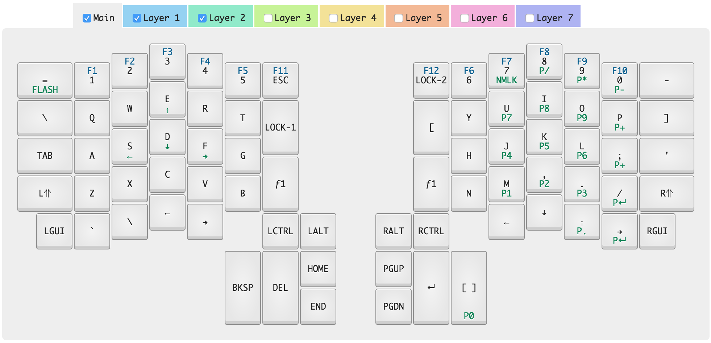

# ergodox-infinity-layout
My setup for my Ergodox Infinity keyboard
# Infinity ErgoDox layout and Kiibohd kll compiler

My layout for the [Infinity ErgoDox](http://input.club/devices/infinity-ergodox) keyboard.

## Editing

The layout files are in kiibohd/*.kll.

- MDErgo1-Default-0.kll is the main layer
- MDErgo1-Default-1.kll is the function layer
- MDErgo2-Default-2.kll is the layer with the keypad and additional arrow keys on the left hand

## Flashing firmware to your Ergodox Infinity

1. Install dfu-util using brew or macports. (brew install dfu-util or port install dfu-util and port install libusb)
2. Enter flash mode on the Ergodox keyboard. (orange LED will turn on)
3. Flash using dfu-util -D.
4. Orange LED will turn off once complete.
5. Profit
